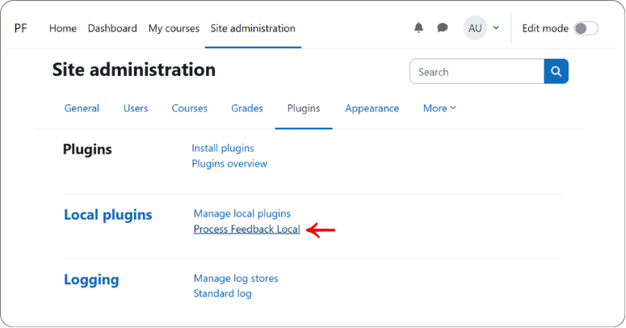
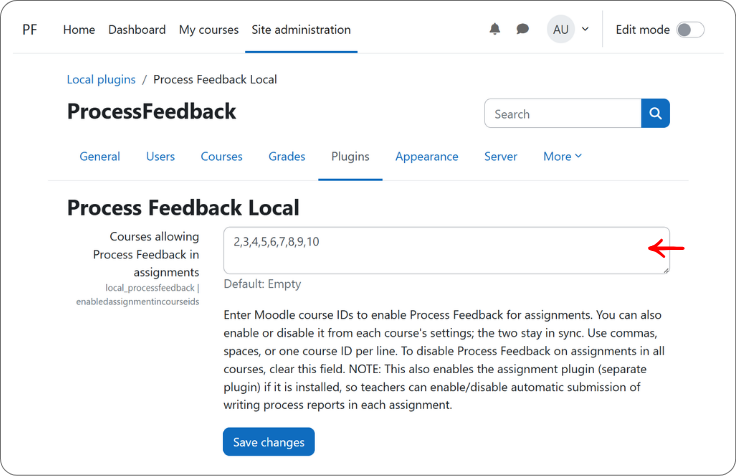
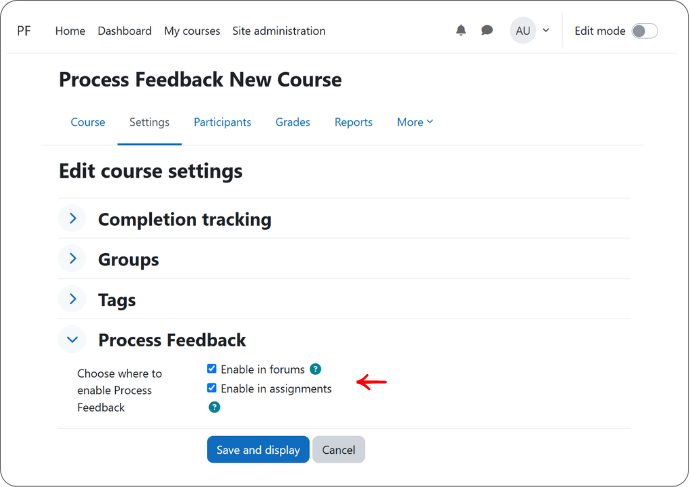
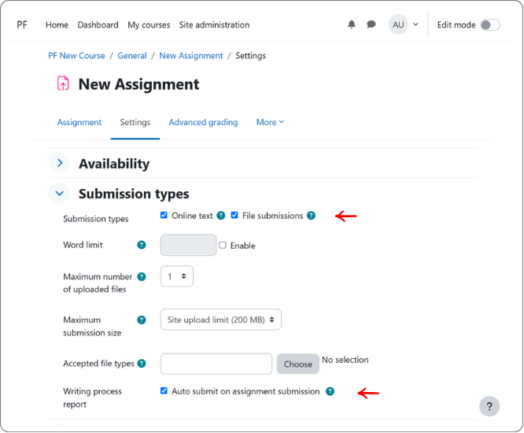

# Process Feedback Moodle Plugin

[Process Feedback](https://processfeedback.org) offers insight into how students write and do their work. Process Feedback for Moodle is made of two plugins that go hand in hand:

**1. Local plugin (this repository)**
Type: Producer and viewer
Purpose: Tracks the writing process in the browser, packages it, uploads it during submission, and opens writing process reports.

**2. Assignment submission plugin ([companion repository](https://github.com/processfeedback/moodle-assignsubmission_processfeedback))**
Type: Receiver, persister, and viewer
Purpose: Accepts the uploaded process data during assignment save, stores it with the submission, and shows it to teachers.

## A. Why two plugins

The two plugins have access to different parts of Moodle. A **local plugin** can add JavaScript to assignment and forum pages, but it can't take part in saving an assignment submission. It has nowhere to store data with a submission and no way to add anything to the teacher's grading view. On the other hand, an **assignment submission plugin** can do all of that, but only inside assignments. It can't run on forum pages or record what a student types. So Process Feedback is split along that line:

**1. Local plugin: collects the data**

- Runs in the student's browser, on assignment and forum pages.
- Records edits, keeps them in the browser (IndexedDB), and packages them into a ZIP when the student submits.
- Adds the student panel, teacher notices, and report links.
- Works on its own.

**2. Assignment submission plugin: stores and shows the data**

- Runs on the Moodle server, when an assignment is saved.
- Receives the ZIP, stores it with the submission, and shows a summary in the teacher's grading view.
- Adds the **Auto submit on assignment submission** setting, plus backup, restore, and privacy (GDPR) support.
- Needs the local plugin. Moodle won't install it on its own.

### Which one to install?

- **Only the local plugin**: students can track their writing, download their process data, and open their own writing process reports. Nothing is stored in Moodle.
- **Both plugins (recommended)**: all of the above, plus teachers can have each student's process data submitted automatically with their assignment and review it from the grading page. Teachers can turn this on or off for each assignment.

## B. Features

**1. For students**

- Their writing is tracked as they type in assignment and forum editors, including paste activity.
- The data stays in their own browser until they choose to download it or submit it.
- A Process Feedback panel on the page tells them their edits are being tracked.
- They can download their process data as a ZIP file.
- They can open their own writing process report in the Process Feedback web application, in a new tab.

**2. For teachers**

- A notice on enabled assignment and forum pages reminds them that Process Feedback is active.
- An **Auto submit on assignment submission** setting for each Online text assignment. When it's on, each student's process data is submitted with their assignment. It's on by default for new assignments. *(needs both plugins)*
- A process summary for each submission in the grading view: active writing time, snapshots count, active days, first edit, last edit, and largest single change, with a link to download the ZIP. *(needs both plugins)*
- A link to open each student's writing process report in a new tab. *(needs both plugins)*
- A Writing Process Dashboard that opens all submitted reports for an assignment together. This is a beta feature and has not been thoroughly tested. *(needs both plugins)*

**3. For site administrators**

- Turn Process Feedback on per course, separately for assignments and forums, from the site settings or from each course's settings.
- Submitted process data is included in Moodle backup and restore and in privacy (GDPR) exports and deletions, along with its assignment submission. *(needs both plugins)*

## C. How it works

Process data follows one path, from the student's keyboard to the teacher's grading page.

### a) While the student writes *(local plugin)*

1. The student opens an assignment or forum in a course where Process Feedback is enabled.
2. The local plugin loads in their browser automatically and shows the Process Feedback panel, which tells them their edits are being tracked.
3. As they type, it records their edits and pastes and saves them in the browser (IndexedDB). Nothing is sent to Moodle or anywhere else.

Because data is stored only in that browser, it does not follow the student to another device or browser. Writing done on a different computer, in a different browser, in a private/incognito window, or before browser data was cleared is not included. If a student writes across several devices, their submitted process data will be incomplete.

The plugin loads only if the course is enabled for that activity type and the user has the `local/processfeedback:use` capability.

### b) When the data leaves the browser

Process data leaves the student's browser in only three ways:

- **Download:** the student saves their process data as a ZIP file from the panel. *(local plugin)*
- **Open a report:** the student opens their writing process report from the panel. This sends their process data to the Process Feedback report page, which builds the report in a new tab without sending any data away from the browser. *(local plugin)*
- **Submit the assignment:** the process data is submitted with the assignment, but only when auto submission is on (see below). *(needs both plugins)*

### c) When the student submits an assignment *(needs both plugins)*

Process data is submitted only when all of these are true:

- both plugins are installed,
- the course is enabled for Process Feedback in assignments,
- the assignment uses the **Online text** submission type, and
- **Auto submit on assignment submission** is ticked in the assignment's settings.

The checkbox is **ticked by default** on new assignments in enabled courses. Teachers who don't want process data submitted automatically must untick it.

When auto submission is on:

1. The submission form tells the student that their writing process data will be included.
2. When they save the submission, the local plugin packages the data as a ZIP and uploads it with the form.
3. The assignment submission plugin stores the ZIP with the submission and records a summary of it.
4. Teachers see the summary in the grading view, and can download the ZIP or open the student's writing process report.

### d) Technical details for developers

- The local plugin's JavaScript entry point is the `local_processfeedback/main` AMD module.
- The assignment submission plugin adds two hidden fields to the submission form. `processfeedback_include_data` tells the local plugin whether to upload process data, and the local plugin puts the uploaded draft's item ID in `processfeedback_draftitemid`.
- On save, the assignment submission plugin accepts the data only if `should_accept_process_data()` returns true, which means the assignment setting is on.
- It reads the summary metrics from `process_summary.json` inside the ZIP and saves them in the `assignsubmission_processfeedback` table. It then moves the ZIP into the submission's `process_files` file area.

## D. Installation requirements

- Moodle 4.4+ (`$plugin->requires = 2024042200`)
- JavaScript and IndexedDB enabled in the student's browser
- For `assignsubmission_processfeedback`: the Moodle assignment activity (`mod_assign`) and `local_processfeedback` version `2026092300` or newer
- **Report-page domain recognition:** for the **Open report** button to open reports automatically, the Moodle site's domain must be added to Process Feedback's recognized-domain list. Institutions interested in piloting should contact us to have their domain added. Until then, users can download the process-data ZIP and load it manually in the Process Feedback report page.

Current release: `0.5.1` (both plugins).

## E. Steps for installing the plugins

Work through these steps in order. Steps 3 and 4 install the assignment submission plugin. Skip them if you only want browser tracking and manual ZIP export.

1. Download `local_processfeedback.zip` from the [`moodle-local_processfeedback` releases page](https://github.com/processfeedback/moodle-local_processfeedback/releases).

2. Copy or extract the ZIP into `<moodleroot>/local`; it contains a single `processfeedback` folder, so you end up with `<moodleroot>/local/processfeedback`.

3. Download `moodle-assignsubmission_processfeedback.zip` from the [`moodle-assignsubmission_processfeedback` releases page](https://github.com/processfeedback/moodle-assignsubmission_processfeedback/releases).

4. Copy or extract that ZIP into `<moodleroot>/mod/assign/submission`; it also contains a single `processfeedback` folder, so you end up with `<moodleroot>/mod/assign/submission/processfeedback`.

5. Visit `Site administration > Notifications` to complete the Moodle upgrade. Both plugins are installed in the same upgrade.

6. Enable Process Feedback for the courses that should use it. There are two ways to do this, and they stay in sync — saving the site settings updates the matching course fields, and saving a course updates the site course-ID lists.

    For several courses at once, go to `Site administration > Plugins > Local plugins > Process Feedback Local`.

    

    Enter the Moodle course IDs for assignments and for forums, then select **Save changes**. Use commas, spaces, or one course ID per line. Leaving a field empty disables Process Feedback for that activity type in all courses.

    

    For a single course, open the course's settings, expand the **Process Feedback** section, and tick **Enable in forums** and/or **Enable in assignments**. Enabling assignments either way also switches on the assignment submission plugin for those courses, so teachers can turn automatic submission on or off per assignment.

    

## F. Testing and rollout

Before rolling out, check that everything works in one course where Process Feedback is enabled.

1. As a teacher, open an assignment in that course. You should see a notice that Process Feedback is active.

2. In the assignment's settings, under **Submission types**, make sure **Online text** is enabled.

3. In the same section, under **Writing process report**, make sure **Auto submit on assignment submission** is ticked. It's ticked by default. *(needs both plugins)*

    

4. Open the assignment as a student. You should see the Process Feedback panel on the page.

5. As the student, type some text in the Online text editor and save the submission. *(needs both plugins)*

6. As the teacher, open the grading view. You should see a process summary for that submission, with a link to download the ZIP. *(needs both plugins)*

If you enabled forums, open a forum in the course and repeat steps 1 and 4.

Once everything works, share these guides with teachers and students, for example in a course announcement, a staff onboarding page, or your Moodle help pages:

- **[Guide for teachers](https://processfeedback.org/moodle-plugin-for-teachers/)**: how to enable Process Feedback on an assignment or forum, what the teacher notices mean, and how to open students' writing process reports from the grading page.
- **[Guide for students](https://processfeedback.org/moodle-plugin-for-students/)**: what is tracked and where it is stored, how to use the Process Feedback panel, and how to download process data or open a writing process report.

## G. Settings reference

- **Courses allowing Process Feedback in assignments** (`local_processfeedback`, site level): the Moodle course IDs where Process Feedback runs on assignments. Empty disables it on assignments everywhere.
- **Courses allowing Process Feedback in forums** (`local_processfeedback`, site level): the Moodle course IDs where Process Feedback runs on forums. Empty disables it on forums everywhere.
- **Enable in assignments / Enable in forums** (`local_processfeedback`, course level): managed course custom fields that mirror the two site settings for a single course.
- **Auto submit on assignment submission** (`assignsubmission_processfeedback`, assignment level): shown under the Writing process report setting when the course is enabled for Process Feedback and the assignment uses the Online text submission type. When checked, each student's process data is submitted automatically as they submit the assignment. Checked by default on new assignments.

Process Feedback runs only when the activity module is supported, the course is enabled for that module, and the user has the required capability.

## H. Capabilities

`local_processfeedback` defines:

- `local/processfeedback:configure`: configure site settings.
- `local/processfeedback:use`: use Process Feedback in supported module contexts.
- `local/processfeedback:viewreports`: view Process Feedback reports.

`assignsubmission_processfeedback` does not define custom capabilities. Access is governed by Moodle assignment permissions:

- Students who can submit can view their own submitted process-data file through Moodle's file API while Process Feedback is enabled for the course.
- Users with assignment grading permission can view submitted process summaries and download process-data ZIP files.

## I. Uninstalling

Uninstalling can permanently delete student data. Read this before removing either plugin.

**Assignment submission plugin**

- Uninstalling it permanently deletes every submitted process-data ZIP and process summary, in every course. This cannot be undone.
- Teachers will no longer be able to open students' submitted writing process reports.
- If you need to keep any of this data, ask teachers to download each student's ZIP from the grading view first.

**Local plugin**

- Moodle won't let you uninstall it while the assignment submission plugin is installed, so remove that one first.
- Students' tracked data stays in their browsers, but they can no longer download it or open reports from Moodle.
- Tell students to download any process data they want to keep before you remove the plugin.

To stop tracking without deleting anything, clear the course IDs in the site settings instead of uninstalling.

## J. Privacy

Process Feedback is local-first. It collects and stores student data as they type on their own device. Data is shared only when either students explicitly share their work or submit their work when auto-submission is enabled.

For `local_processfeedback`:

- This plugin stores students' personal writing process data in their browser, by default. Data is not automatically collected or stored in Moodle database tables or elsewhere on every edit.
- Clearing browser data permanently deletes any process data that the student has not downloaded or submitted.
- Student exported process data ZIP or shared writing process reports contain personal data.
- Student-submitted process data is stored and exported by the companion assignment submission plugin.

For `assignsubmission_processfeedback`:

- Unlike the local plugin, which keeps process data in the student's browser, this plugin stores process data in Moodle when a student submits an assignment with auto-submission enabled.
- It stores process summary metadata in the `assignsubmission_processfeedback` database table and the submitted process-data ZIP file in Moodle's `core_files` subsystem.
- The database record contains the assignment ID, submission ID, edit time, revision count, active days, first edit timestamp, last edit timestamp, and largest change size.
- The submitted ZIP file and summary values may contain personal or educational data.
- The privacy provider supports context discovery, data export, and deletion for Moodle privacy (GDPR) requests.
- Uninstalling the plugin permanently deletes its database table and all stored process-data ZIP files; export any data you need to keep first.

Writing process data should be handled with permission from the author and following the student's institution's privacy, assessment, and retention policies.

## K. Development

`local_processfeedback` bundles AMD JavaScript. From a checkout of the [`moodle-local_processfeedback`](https://github.com/processfeedback/moodle-local_processfeedback) repository, build it with:

```bash
npm install
npm run build
```

`assignsubmission_processfeedback` is PHP only and needs no build step.

## L. Issues

Report bugs and feature requests on our [contact page](https://processfeedback.org/contact/).

## M. License

Both plugins are licensed under the GNU GPL v3 or later. See [LICENSE](LICENSE).

Third-party libraries bundled with `local_processfeedback` are listed in [thirdpartylibs.xml](thirdpartylibs.xml).

## N. Research citation

Adhikari, Badri; "Thinking Beyond Chatbots' Threat to Education: Visualizations to Elucidate the Writing or Coding Process"; Education Sciences; 2023.

## O. More information

Learn more about the plugins on the [Process Feedback website](https://processfeedback.org/moodle-plugin/).
